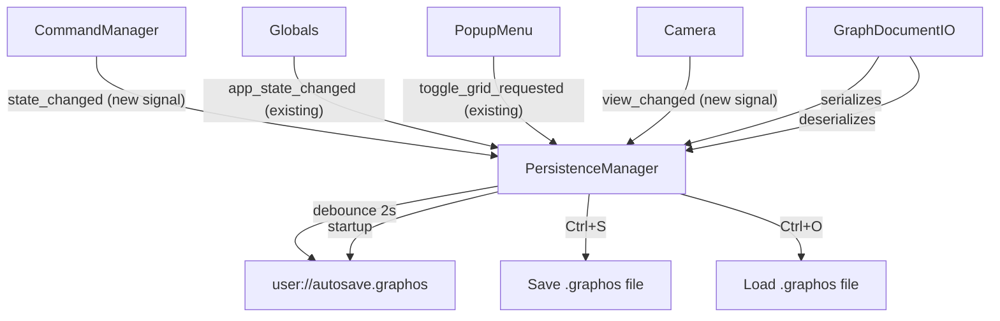

# Graphos Persistence Plan

## How Excalidraw Does It (key lessons)

Excalidraw separates persistence into two tiers:

1. **Auto-save** — `serializeAsJSON()` triggered on every `onChange`, debounced ~1s, written to browser storage (localStorage/IndexedDB). Restored silently on page load.
2. **Explicit file I/O** — Ctrl+S / Ctrl+O for `.excalidraw` JSON files. Same schema as auto-save.
3. **Format**: a single JSON root with `format_version`, a `elements` array, and an `appState` object (zoom, scroll, grid, active tool, etc.).
4. **Restoration / migration**: a `restore()` layer fills in missing fields and handles version upgrades gracefully.

We adopt the same shape for Graphos, adapted to Godot's `user://` filesystem.

---

## JSON Format v2 (`.graphos` file)

Extends the existing `format_version: 1` preset schema:

```json
{
  "format_version": 2,
  "next_vertex_id": 12,
  "vertices": [ { "id": 0, "pos": [x,y], "color": [r,g,b,a] } ],
  "edges": [ { "from": 0, "to": 1, "strategy": "undirected", "weighted": false, "weight": 1.0, "color": [r,g,b,a] } ],
  "app_state": {
    "active_strategy": "undirected",
    "is_weighted_mode": false,
    "grid_enabled": false,
    "camera_position": [0.0, 0.0],
    "camera_zoom": 1.0
  }
}
```

`next_vertex_id` is needed to restore the ID counter on `Graph` so future vertices don't collide with loaded ones.

---

## Architecture




---

## Files to Create

### `core/persistence/graph_document_io.gd`

Pure `RefCounted` class (no Node/scene dependencies). Extends the preset serialization pattern of `[core/presets/graph_preset_io.gd](core/presets/graph_preset_io.gd)`:

- `save_to_path(graph, next_id, camera_pos, camera_zoom, grid_enabled, strategy_str, is_weighted, path) -> bool`
- `load_from_path(path) -> Dictionary` — returns `{ graph, next_vertex_id, app_state }` or null on failure
- `_restore_app_state(data: Dictionary) -> Dictionary` — fills defaults for missing keys (migration safety)
- `FORMAT_VERSION := 2`

### `scenes/main/persistence_manager.gd`

A `Node` added to the main scene. Wires all signals and orchestrates save/load:

- **Inspector-assigned refs**: `graph`, `camera`, `grid_background`, `popup_menu`, `command_manager`
- **Auto-save timer**: a `Timer` node (2s one-shot, retriggered on each dirty event)
- `_dirty()` — marks pending save, restarts timer
- `_save_to(path)` — calls `GraphDocumentIO.save_to_path(...)`, writes to `path`
- `_load_from(path)` — calls `GraphDocumentIO.load_from_path(...)`, then:
  - Clears graph via `CommandManager` or direct `graph.clear()`
  - Rehydrates vertices/edges using existing `GraphPresetIO.graph_from_dictionary()` path
  - Sets `graph._next_vertex_id`
  - Restores `Globals.active_strategy`, `Globals.is_weighted_mode`
  - Calls `camera.position = ...` and `camera._target_zoom = ...`
  - Calls `grid_background.set_grid_enabled(...)`
- `_on_ready()` — if `user://autosave.graphos` exists, call `_load_from("user://autosave.graphos")`
- `_input(event)` — Ctrl+S triggers save dialog (or saves to last path), Ctrl+O triggers open dialog

---

## Files to Modify

### `[commands/command_manager.gd](commands/command_manager.gd)`

Add `signal state_changed` emitted at the end of `execute()`, `undo()`, and `redo()`.

### `[scenes/camera/camera.gd](scenes/camera/camera.gd)`

Add `signal view_changed` emitted after pan or zoom settles (end of `_zoom_camera()` and end of mouse-motion pan).

### `[scenes/main/main.tscn](scenes/main/main.tscn)`

Add `PersistenceManager` node (child of root) and wire its exported node paths to existing Camera, Graph, MathGridBackground, PopupMenuManager, CommandManager nodes.

---

## State Mapping: What Gets Saved


| State                                      | Source                             | Saved?                          |
| ------------------------------------------ | ---------------------------------- | ------------------------------- |
| Vertices (id, pos, color)                  | `Graph.vertices`                   | Yes                             |
| Edges (endpoints, strategy, weight, color) | adjacency list                     | Yes                             |
| Next vertex ID counter                     | `Graph._next_vertex_id`            | Yes                             |
| Active strategy (directed/undirected)      | `Globals.active_strategy`          | Yes                             |
| Weighted mode                              | `Globals.is_weighted_mode`         | Yes                             |
| Grid enabled                               | `MathGridBackground.grid_enabled`  | Yes                             |
| Camera position                            | `Camera2D.position`                | Yes                             |
| Camera zoom                                | `Camera._target_zoom`              | Yes                             |
| Current tool mode                          | `Globals.current_state`            | No — reset to SELECTION on load |
| Algorithm player state                     | `AlgorithmPlayer.`*                | No — session only               |
| Undo/redo stack                            | `CommandManager.`*                 | No — cleared on load            |
| Selection                                  | `GraphController.selection_buffer` | No — transient                  |


---

## Auto-save Trigger Points

The `PersistenceManager._dirty()` method is called from:

1. `CommandManager.state_changed` — covers all vertex/edge add/delete/move/color changes
2. `Globals.app_state_changed` — covers strategy and tool mode changes
3. `popup_menu.toggle_grid_requested` — grid toggle
4. `Camera.view_changed` — pan or zoom

---

## Keyboard Shortcuts


| Key          | Action                                                |
| ------------ | ----------------------------------------------------- |
| Ctrl+O       | Open file dialog → load `.graphos`                    |
| Ctrl+S       | Save to last known path (or open save dialog if none) |
| Ctrl+Shift+S | Save As — always opens save dialog                    |


Handled in `PersistenceManager._input()`, consuming the event to prevent other handlers from firing.

---

## Migration Safety

`_restore_app_state()` in `GraphDocumentIO` uses `data.get("key", default)` for every field so loading `format_version: 1` preset files (which have no `app_state`) remains safe and gracefully defaults to initial state.