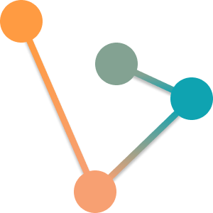

<div align="center">



# Graphos

**Interactive graph editor & algorithm visualizer**

Build graphs. Run algorithms. Understand them step-by-step.

<br/>

<a href="https://verticesltd.github.io/Graphos/" target="_blank" rel="noopener noreferrer">
  <strong>▶ &nbsp;Open the Live Demo</strong>
</a>

</div>

---

## Overview

Graphos is a **browser-based system for constructing graphs and visualizing classic algorithms in real time**.

Unlike static visualizers, Graphos executes algorithms on **user-created graphs**, while exposing their internal state through a synchronized timeline and pseudocode view.

The goal is simple: make abstract graph algorithms **intuitive, inspectable, and debuggable**.

---

## Key Capabilities

### Graph Construction
- Create arbitrary graphs with **directed / undirected edges**
- Support for **weighted graphs**
- Infinite canvas with **pan & zoom**
- Multi-select, edit, recolor, and transform subgraphs
- Import/export via a **custom JSON format**

### Algorithm Visualization
- Step-by-step execution on **real user input**
- Full **timeline system** with forward/backward scrubbing
- **Pseudocode synchronization** (see exactly what line is executing)
- Auto-play + manual stepping
- Handles **disconnected graphs** correctly

### Editing System
- Full **undo/redo architecture (Command Pattern)**
- Clipboard support (copy / cut / paste subgraphs)
- Persistent **auto-save + manual save/load**
- Share graphs via encoded URLs

---

## Algorithms Implemented

- BFS (Breadth-First Search)  
- DFS (Depth-First Search)  
- Dijkstra (Shortest Paths)  
- Prim (Minimum Spanning Tree)  
- Kruskal (Minimum Spanning Forest, Union-Find)

---

## Architecture Highlights

### Command-Based State Management
All mutations are implemented as commands:
- `execute()` / `undo()`
- Enables full undo/redo across **all operations**
- Clean separation between **intent and effect**

### Algorithm Timeline Engine
Algorithms do not mutate state directly.

Instead, they emit **visual commands**:
- Each step is recorded
- Playback system replays them deterministically
- Enables scrubbing, replay, and debugging

---

### Separation of Concerns
- **Core layer**: pure graph data structures + serialization  
- **Algorithm layer**: logic only, no UI  
- **Presentation layer**: visualization + interaction  

Everything is decoupled and testable.

---

### Deterministic Serialization
Custom `.graphos` format:
- Pure JSON
- Fully reconstructible state
- Shareable via URL encoding

---

## Tech Stack

- Godot 4 (GDScript)
- HTML5 export (runs fully in browser)

---

## Why This Project Matters

Most algorithm visualizers:
- use fixed examples  
- hide internal state  
- don’t allow experimentation  

Graphos provides:
- **full control over input**
- **full visibility into execution**
- **replayable algorithm behavior**

It acts more like a **debugger for graph algorithms** than a simple demo.

---

## Run Locally

```bash
git clone https://github.com/verticesltd/Graphos.git
